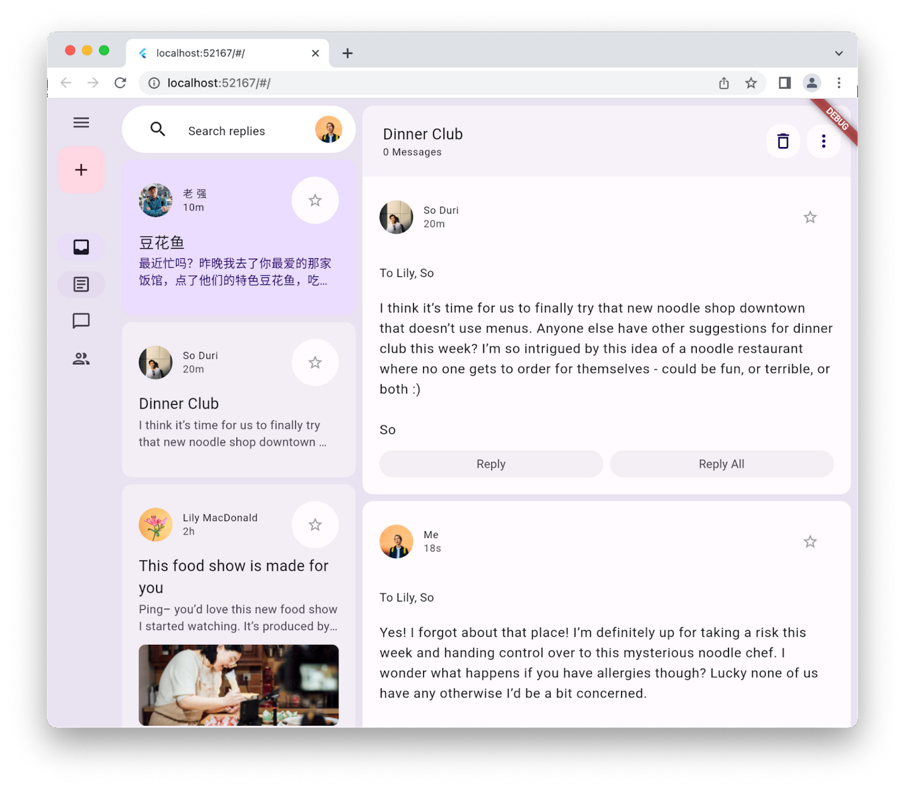

# Application de Messagerie

## Introduction
Ce projet est une application de messagerie conçue lors du codelab https://codelabs.developers.google.com/codelabs/flutter-animated-responsive-layout. Cette documentation vise à expliquer les différents fichiers et composants de l'application de messagerie. L'objectif est de fournir une compréhension claire de la structure du code et du fonctionnement de l'application, permettant ainsi à toute personne souhaitant contribuer ou simplement comprendre le code de s'orienter facilement.

## Démo
Voici un aperçue de l'application qui a été faite :

## Structure du Projet
L'application est organisée en plusieurs fichiers et dossiers, chacun ayant un rôle spécifique. Voici un aperçu de la structure du projet :

- **lib/**: Contient le code source de l'application.
  - **animations.dart**: Définit les animations utilisées dans l'application.
  - **destinations.dart**: Définit les destinations de navigation.

  - **models/**
    - **data.dart**: Fichiers de données factices utilisées dans l'application.
    - **models.dart**: Définition des modèles de données utilisés dans l'application.

  - **transition/**
    - **bottom_bar_transition.dart**: Transition animée pour la barre de navigation inférieure.
    - **list_detail_transition.dart**: Transition animée pour afficher les détails des éléments de la liste.
    - **nav_rail_transition.dart**: Transition animée pour le rail de navigation.

  - **widget/**
    - **animated_floating_action_button.dart**: Bouton d'action flottant animé.
    - **disappearing_bottom_navigation_bar.dart**: Barre de navigation inférieure avec animation de disparition.
    - **disappearing_navigation_rail.dart**: Rail de navigation avec animation de disparition.
    - **email_list_view.dart**: Liste des e-mails.
    - **email_widget.dart**: Widget d'affichage d'un e-mail.
    - **reply_list_view.dart**: Liste des réponses aux e-mails.
    - **search_bar.dart**: Barre de recherche d'e-mails.

## Description des fichiers

1.1 animations.dart

- Ce fichier définit plusieurs animations utilisées dans l'application. Voici une explication de chaque classe :

    - **BarAnimation**:
        Cette classe étend ReverseAnimation et représente une animation utilisée pour un élément de barre
        Elle définit une animation courbe avec un intervalle pour l'animation normale et un intervalle inversé pour l'animation en sens inverse.
    
    - **OffsetAnimation** :
        Cette classe étend CurvedAnimation et représente une animation d'offset (décalage).
        Elle définit une animation courbe pour un intervalle spécifique et son inverse pour l'animation en sens inverse.

    - **RailAnimation** :
        Cette classe étend CurvedAnimation et représente une animation utilisée probablement pour une navigation ferroviaire.
        Elle définit une animation courbe avec un intervalle pour l'animation normale et un intervalle inversé pour l'animation en sens inverse.

    - **RailFabAnimation** :
        Cette classe étend CurvedAnimation et représente une animation utilisée probablement pour un bouton d'action flottant dans la navigation ferroviaire.
        Elle définit une animation courbe pour un intervalle spécifique.

    - **ScaleAnimation**:
        Cette classe étend CurvedAnimation et représente une animation de mise à l'échelle.
        Elle définit une animation courbe pour un intervalle spécifique et son inverse pour l'animation en sens inverse.

    - **ShapeAnimation**:
        Cette classe étend CurvedAnimation et représente une animation de forme.
        Elle définit une animation courbe pour un intervalle spécifique.

    - **SizeAnimation** :
        Cette classe étend CurvedAnimation et représente une animation de taille.
        Elle définit une animation courbe pour un intervalle spécifique et son inverse pour l'animation en sens inverse.

 *1.2 destinations.dart

- Ce fichier contient la définition des destinations de navigation de l'application, telles que "Inbox", "Articles", "Messages", etc. Voici une explication de son contenu :

    - Tout d'abord dans ce fichier on a la classe Destination
        Destination est une classe simple qui représente une destination.
        - Elle a deux propriétés :
            1. icon : Une icône représentant la destination, de type IconData.
            2. label : Une étiquette décrivant la destination, de type String.
        - La classe est définie avec un constructeur constant pour pouvoir être utilisée dans des contextes où la constance est requise.

    - Ensuite dans le fichier on à la liste destinations
        destinations est une liste de destinations.
        - Chaque élément de la liste est une instance de la classe Destination.
        - Chaque instance contient une icône et une étiquette correspondant à une destination spécifique.
        - Les destinations incluses dans cette liste sont :
            1. "Inbox" avec l'icône Icons.inbox_rounded.
            2. "Articles" avec l'icône Icons.article_outlined.
            3. "Messages" avec l'icône Icons.messenger_outline_rounded.
            4. "Groups" avec l'icône Icons.group_outlined.

En résumé, ce fichier fournit une manière pratique de définir et de stocker des destinations, ce qui peut être utile pour la navigation ou d'autres fonctionnalités dans une application Flutter.

2.1 models/data.dart

- Ce fichier contient des données d'exemple :

    - Il crée plusieurs instances d'utilisateurs (User) avec différents noms, URLs d'avatar et dates de dernière activité.
    - Il définit une liste d'e-mails (emails) contenant plusieurs e-mails avec des expéditeurs, des destinataires, des sujets, des contenus et des pièces jointes simulés.
    - Il définit également une liste de réponses (replies) simulant des réponses à certains e-mails, avec des expéditeurs, des destinataires, des sujets et des contenus similaires à ceux des e-mails d'origine.

2.2 models/models.dart

- Ce fichier définit plusieurs classes de modèles de données :

    - Attachment: Représente une pièce jointe à un e-mail. Il a un seul champ url qui indique l'URL de la pièce jointe.
    - Email: Représente un e-mail avec des informations telles que l'expéditeur, les destinataires, le sujet, le contenu, les pièces jointes et le nombre de réponses. Les pièces jointes sont stockées dans une liste d'objets Attachment.
    - Name: Représente le nom d'une personne, composé de prénom et de nom. Il a également une méthode fullName pour obtenir le nom complet.
    - User: Représente un utilisateur avec des informations telles que le nom, l'URL de l'avatar et la date de dernière activité. Le nom est un objet de type Name.

3.1 transition/bottom_bar_transition.dart

- Ce fichier contient la transition animée pour la barre de navigation inférieure. Voici une explication de son contenu :
    - **BottomBarTransition**
        * Ce widget est un StatefulWidget responsable de l'animation de transition d'une barre inférieure.
        * Il prend trois arguments obligatoires :
            1. animation : L'animation contrôlant la transition.
            2. backgroundColor : La couleur de fond de la barre inférieure.
            3. child : Le widget enfant à afficher dans la barre inférieure.
        - Il utilise deux animations :
            1. offsetAnimation : Une animation d'offset contrôlant le déplacement de la barre inférieure. Elle est définie à l'aide de OffsetAnimation en fonction de l'animation parent.
            2. heightAnimation : Une animation de hauteur contrôlant la hauteur de la barre inférieure. Elle est définie à l'aide de SizeAnimation en fonction de l'animation parent.
        - Dans le constructeur de ClipRect, il enveloppe l'enfant dans un DecoratedBox avec une couleur de fond spécifiée par backgroundColor.
        - Il utilise Align pour positionner l'enfant dans le coin supérieur gauche.
        - La hauteur de l'enfant est déterminée par la valeur de l'animation heightAnimation.
        - Le décalage de l'enfant est déterminé par la valeur de l'animation offsetAnimation.

En résumé, ce widget permet de créer une transition fluide pour une barre inférieure dans interface utilisateur en animant à la fois sa position verticale et sa hauteur.

3.2 transition/list_detail_transition.dart

- Ce fichier contient la transition animée pour afficher les détails des éléments de la liste. Voici une explication de son contenu :
    - **ListDetailTransition** 
        - Ce widget est un StatefulWidget responsable de l'animation de transition entre deux widgets : one et two.
        - Il prend trois arguments obligatoires :
            1. animation : L'animation contrôlant la transition.
            2. one : Le premier widget (une liste).
            3. two : Le deuxième widget (une vue détaillée).
        - Il utilise trois animations :
            1. sizeAnimation : Une animation de taille contrôlant la taille de la transition. Elle est définie à l'aide de SizeAnimation en fonction de l'animation parent.
            2. offsetAnimation : Une animation d'offset contrôlant le déplacement du deuxième widget. Elle est définie à l'aide de OffsetAnimation en fonction de l'animation de taille.
            3. widthAnimation : Une animation de largeur contrôlant la largeur du deuxième widget. Elle est ajustée en fonction de la largeur de l'écran.
        - Dans didChangeDependencies(), il ajuste la largeur de la transition en fonction de la largeur de l'écran en utilisant des facteurs de flexibilité. Cette logique est utilisée pour déterminer la largeur du deuxième widget en fonction de la taille de l'écran.
        - Dans build(), il affiche soit le premier widget (one) si la largeur de la transition est égale à zéro, soit les deux widgets (one et two) côte à côte avec une largeur de transition appropriée.

En résumé, ce widget permet de créer une transition fluide entre une liste et une vue détaillée en ajustant dynamiquement la largeur du deuxième widget en fonction de la taille de l'écran et en animant son déplacement.

3.3 transition/nav_rail_transition.dart

- Ce fichier contient la transition animée pour le rail de navigation (barre de navigation latérale). Voici une explication de son contenu

    - **NavRailTransition** :
        - Ce widget est un StatefulWidget qui gère l'animation de transition d'une barre de navigation latérale.
        - Il prend trois arguments obligatoires :
            1. animation : L'animation contrôlant la transition.
            2. child : Le widget de contenu à animer.
            3. backgroundColor : La couleur de fond de la barre de navigation latérale.
        - Il utilise deux animations :
            1. offsetAnimation : Une animation d'offset contrôlant le déplacement du widget de contenu. L'offset commence à gauche (-1) et se déplace vers la position zéro, soit l'emplacement d'origine.
            2. widthAnimation : Une animation de largeur contrôlant la largeur du widget de contenu. La largeur commence à zéro et atteint la valeur de 1 pour afficher pleinement le contenu.
    - Dans la méthode build() :
        - Il utilise ClipRect pour s'assurer que le contenu reste visible même s'il déborde de la barre de navigation latérale.
        - Il utilise DecoratedBox pour appliquer une couleur de fond à la barre de navigation latérale.
        - Il utilise AnimatedBuilder pour reconstruire le widget lorsque l'animation de la largeur change.
        - Dans le constructeur de Align, il utilise widthFactor pour contrôler la largeur du widget en fonction de la valeur de l'animation widthAnimation.
        - Il utilise FractionalTranslation pour déplacer le contenu en fonction de la valeur de l'animation offsetAnimation.

En résumé, ce widget permet de créer une transition fluide de la barre de navigation latérale en animant le déplacement et la largeur du contenu en fonction de l'animation fournie.

4.1 widget/animated_floating_action_button.dart

- Ce fichier contient le widget du bouton d'action flottant animé.Voici une explication de son contenu :

    - **AnimatedFloatingActionButton**
        - Ce widget est un StatefulWidget qui gère l'animation d'un bouton flottant.
        - Il prend les arguments suivants :
            1. animation : L'animation contrôlant la transition du bouton flottant.
            2. onPressed : La fonction à appeler lorsque le bouton est pressé.
            3. child : Le widget enfant du bouton flottant.
            4. elevation : L'élévation du bouton flottant.
        - Il utilise deux animations :
            1. _scaleAnimation : Une animation de mise à l'échelle contrôlant la taille du bouton flottant.
            2. _shapeAnimation : Une animation contrôlant la forme du bouton flottant.
    - Dans la méthode build() :
        - Il utilise ScaleTransition pour appliquer l'animation de mise à l'échelle au bouton flottant.
        - Il utilise _colorScheme pour obtenir le schéma de couleur à partir du thème actuel de l'application.
        - Il définit la forme du bouton flottant en utilisant RoundedRectangleBorder avec un rayon de bordure qui est interpolé entre 30 et 15 à l'aide de l'animation _shapeAnimation.
        - Il définit la couleur de fond du bouton flottant en utilisant _colorScheme.tertiaryContainer.
        - Il définit la couleur de premier plan (foreground) du bouton flottant en utilisant `_colorScheme.    onTertiaryContainer`.
        - Il utilise widget.onPressed comme gestionnaire d'événements lorsque le bouton est pressé.
        - Il utilise widget.child comme contenu du bouton flottant.

En résumé, ce widget crée un bouton flottant animé dont la taille et la forme sont contrôlées par des animations, et dont les couleurs sont définies en fonction du thème de l'application.

4.2 widget/disappearing_bottom_navigation_bar.dart

- Ce fichier contient le widget de la barre de navigation inférieure avec animation de disparition. Voici une explication de son contenu :

    - **DisappearingBottomNavigationBar**
        - Il s'agit d'un widget Stateless qui affiche une barre de navigation inférieure avec une animation de transition.
        - Il prend les paramètres suivants :
            1. barAnimation : Une animation utilisée pour contrôler l'apparition et la disparition de la barre de navigation.
            2. selectedIndex : L'index de l'élément sélectionné dans la barre de navigation.
            3. onDestinationSelected : Un rappel qui est appelé lorsque l'utilisateur sélectionne une destination dans la barre de navigation.
        - Dans sa méthode build, il retourne un BottomBarTransition, qui est un widget personnalisé défini ailleurs dans l'application, pour gérer l'animation de transition de la barre de navigation.

    - **BottomBarTransition**
        - BottomBarTransition est un widget défini ailleurs dans l'application (bottom_bar_transition.dart).
        - Il utilise une animation pour animer l'apparition et la disparition de la barre de navigation.
        - Il prend comme paramètres :
            1. animation : L'animation utilisée pour contrôler la transition de la barre de navigation.
            2. backgroundColor : La couleur de fond de la barre de navigation.
            3. child : Le contenu de la barre de navigation, généralement un widget NavigationBar.

    - **NavigationBar**
        - NavigationBar semble être un widget personnalisé défini ailleurs dans l'application.
        - Il affiche les éléments de la barre de navigation et gère la sélection des destinations.

    - **destinations**
        - destinations est une liste de destinations définie dans un autre fichier (destinations.dart).
        - Chaque destination est représentée par une icône et une étiquette.

En résumé, ce widget DisappearingBottomNavigationBar encapsule une barre de navigation inférieure avec une animation de transition, permettant à la barre de navigation de s'afficher et de disparaître de manière fluide.

4.3 widget/disappearing_navigation_rail.dart

- Ce fichier contient le widget du rail de navigation latéral avec animation de disparition. Voici une explication de son contenu :

    - **DisappearingNavigationRail**
        - Il s'agit d'un widget Stateless qui affiche un rail de navigation latéral avec une animation de transition.
        - Il prend les paramètres suivants :
            1. railAnimation : Une animation utilisée pour contrôler l'apparition et la disparition du rail de navigation.
            2. railFabAnimation : Une animation utilisée pour contrôler l'apparition et la disparition du bouton d'action flottant associé au rail de navigation.
            3. backgroundColor : La couleur de fond du rail de navigation.
            4. selectedIndex : L'index de l'élément sélectionné dans le rail de navigation.
            5. onDestinationSelected : Un rappel qui est appelé lorsque l'utilisateur sélectionne une destination dans le rail de navigation.
        - Dans sa méthode build, il retourne un NavRailTransition, qui est un widget personnalisé défini ailleurs dans l'application, pour gérer l'animation de transition du rail de navigation.

    - **NavRailTransition**
        - NavRailTransition est un widget défini ailleurs dans l'application (nav_rail_transition.dart).
        - Il utilise une animation pour animer l'apparition et la disparition du rail de navigation.
        - Il prend comme paramètres :
            1. animation : L'animation utilisée pour contrôler la transition du rail de navigation.
            2. backgroundColor : La couleur de fond du rail de navigation.
            3. child : Le contenu du rail de navigation, généralement un widget NavigationRail.

    - **NavigationRail**
        - NavigationRail est un widget prédéfini de Flutter qui affiche un rail de navigation latéral.
        - Il prend en charge la sélection de destinations et l'affichage des icônes et des étiquettes de destination.

    - **destinations**
        - destinations est une liste de destinations définie dans un autre fichier (destinations.dart).
        - Chaque destination est représentée par une icône et une étiquette.

En résumé, ce widget DisappearingNavigationRail encapsule un rail de navigation latéral avec une animation de transition, permettant au rail de navigation de s'afficher et de disparaître de manière fluide, ainsi qu'un bouton d'action flottant associé.

4.4 widget/email_list_view.dart

- Ce fichier contient le widget de la liste des e-mails.

    - **EmailListView**: 
        - Ce widget représente la vue de liste des e-mails dans ton application.
        Il prend en entrée l'index de l'élément sélectionné (selectedIndex), une fonction de rappel pour gérer la sélection (onSelected) et l'utilisateur actuel (currentUser).
        - Il affiche une liste d'e-mails à l'aide du widget ListView.
        - Avant la liste des e-mails, il affiche la barre de recherche MySearchBar.
        - Il génère dynamiquement des widgets EmailWidget pour chaque e-mail dans la liste de données d'e-mails.
        - Chaque EmailWidget est enveloppé dans un Padding pour ajouter un espace entre chaque élément de la liste.

4.5 widget/email_widget.dart

- Ce fichier contient le widget d'affichage d'un e-mail. Il contient plusieurs classes qui définissent différents composants d'affichage pour représenter les e-mails dans l'application. Voici une explication détaillée de chaque classe :

    - **EmailWidget** :
        - Ce widget est responsable de l'affichage global d'un e-mail.
        - Il peut être configuré pour afficher l'e-mail sous forme de prévisualisation (isPreview) ou en mode fil de discussion (isThreaded).
        - Il utilise un GestureDetector pour détecter les interactions de l'utilisateur (comme les clics).
        - L'affichage de l'e-mail est délégué à d'autres widgets en fonction de ses paramètres.

    - **EmailContent**
        - Ce widget représente le contenu d'un e-mail.
        - Il affiche des informations telles que l'expéditeur, le sujet et le contenu de l'e-mail.
        - L'affichage peut être configuré en tant que prévisualisation (isPreview) ou en mode fil de discussion (isThreaded).

    - **EmailHeadline**
        - Ce widget représente l'en-tête d'un e-mail.
        - Il affiche des informations telles que le sujet de l'e-mail et le nombre de réponses.

    - **EmailReplyOptions**
        - Ce widget représente les options de réponse pour un e-mail.
        - Il affiche des boutons pour répondre ou répondre à tous.

Dans l'ensemble, ces widgets constituent des éléments modulaires de l'interface utilisateur pour représenter les e-mails de manière claire et concise, en fournissant des fonctionnalités telles que l'affichage de la prévisualisation, du contenu détaillé, de l'en-tête et des options de réponse.

4.6 widget/reply_list_view.dart

- Ce fichier définit un widget qui affiche une liste de réponses à des e-mails. Voici une explication de son contenu :

    - **ReplyListView**
    Ce widget est responsable de l'affichage d'une liste de réponses à des e-mails. Il ne prend aucun argument en entrée.
    - Il utilise un ListView pour afficher les réponses à mesure qu'elles défilent.
    - Il génère dynamiquement des widgets EmailWidget pour chaque réponse à partir des données de réponses disponibles dans le fichier data.dart.
    - Chaque EmailWidget est enveloppé dans un Padding pour ajouter un espace entre chaque élément de la liste.
    Le premier élément de la liste (index == 0) est configuré pour afficher l'en-tête de l'e-mail à l'aide du paramètre showHeadline.

En résumé, ce fichier contribue à la partie de ton application qui affiche une liste de réponses à des e-mails. Il utilise le widget EmailWidget pour afficher chaque réponse dans un format adapté, en tenant compte de la mise en forme et de la disposition appropriées.

4.7 widget/search_bar.dart

- Ce fichier contient le widget de la barre de recherche d'e-mails.

    - MySearchBar: Ce widget représente la barre de recherche dans l'interface utilisateur de ton application.Il prend en entrée l'utilisateur actuel (currentUser).
    - Il affiche une barre de recherche avec une icône de recherche à gauche, un champ de texte extensible pour saisir
    - le terme de recherche et l'avatar de l'utilisateur actuel à droite.
    - Le champ de texte affiche un hint "Search replies" lorsqu'il est vide.

## Installation
1. Cloner le dépôt GitHub sur votre machine locale.
2. Ouvrir le projet dans votre éditeur de code préféré.
3. Exécuter `flutter pub get` pour installer les dépendances.
4. Lancer l'application en utilisant `flutter run`.

## Contribution
Les contributions au projet sont les bienvenues ! Voici comment vous pouvez contribuer :
- Créez une "issue" pour signaler un bogue ou demander une fonctionnalité.
- Proposez des modifications en ouvrant une "pull request".
